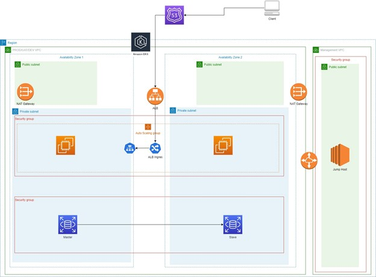
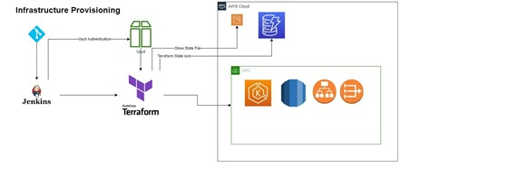
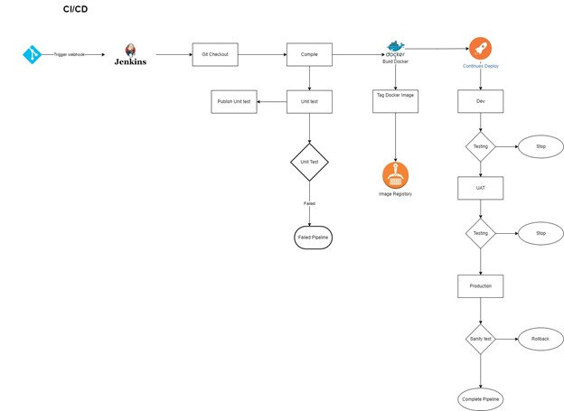

Symbiosis Challenge 1
=====================

Architecture diagram 
---------------------

As per the primary requirement of the organization, this application
will deploy on AWS cloud.

Features
--------

-   Scalable

-   High availability

-   Cloud manage SQL DB

-   Serving high traffics

Requirements and solution with tools 
-------------------------------------

-   **Private Isolate Network**

    -   This application deploy on private subnet, so cannot reach
        through the internet.

    -   Different VPCs for different environments like Dev, UAT,
        Productions and management.

    -   Management VPC use for administrative activities on DEV, UAT and
        Production environments. Therefore, Management VPC has VPC
        peering between other DEV, UAT and Production environments. As a
        pre-requisites, Management VPC should be created manually by
        Infrastructure engineer. Subnet of 24 CIDR block will be more
        than enough for this task. Following IP ranges are example for
        this VPC network requirement.

        -   Ex – VPC –

            -   dev – 10.0.0.0/24,

            -   uat – 10.0.1.0/24,

            -   prod – 10.0.2.0/24

        -   Ex – Public Subnet

            -   Dev – 10.0.0.0/26, 10.0.0.64/26

            -   UAT – 10.0.1.0/26, 10.0.0.64/26

            -   Prod – 10.0.2.0/26, 10.0.0.64/26

        -   Ex – private subnet

            -   Dev – 10.0.0.128/26,10.0.0.192/26

            -   UAT – 10.0.1.128/26, 10.0.0.192/26

            -   Prod – 10.0.2.128/26, 10.0.0.192/26

    -   We can use AWS VPC CNI for Kubernetes cluster, which offer AWS
        support and Can use IPs from another subnet when there is lack
        of IPs.

-   **Two Tier Architecture** – This proposed architecture is a two tier
    architecture, which has web tier and DB tier separately, both use
    same shared private subnets. There is a capability to move DB tier
    to different private subnet base on the requirement. As a Web tier,
    we can use EKS cluster, which provide many advantages
    to organizations.

    -   Benefits of EKS.

        -   Amazon EKS offers a fully managed control plane (the part of
            a Kubernetes cluster that monitors and oversees the nodes in
            the cluster), automatically handling availability and
            scalability concerns.

        -   EKS includes a wide range of security features: IAM
            authentication, VPC (virtual private cloud) support,
            and more.

        -   Amazon EKS is compatible with both the Windows and Linux
            operating systems, including both Windows and Linux nodes in
            the same cluster.

        -   EKS automatically performs load balancing using the AWS
            Elastic Load Balancing feature, distributing traffic across
            multiple instances, containers, and availability zones.

        -   Can run deamonset or privileges pod

-   **High Availability** –

    -   This application proposed to deploy on EKS cluster under
        autoscaling group in two availability zones. So there is no
        single point of failure.

    -   For Pods, we can
        configure the horizontal auto scaler

    -   DB proposed to deploy on RDS instance with enabling multi AZ to
        address high availability requirements.

    -   Since this approach on Kubernetes cluster, We can configure the
        **Pod Topology Spread** to reach stable state on application in
        event of availability zone failure.

-   **Web access through Internet** – In here, we have introduced
    Application Load balance with ALB ingress controller, that will be
    exposed to the public to serve HTTP traffics into the application.

-   **Database Tier Security** - This has been addressing with Security
    group, which blocked all ingress traffics except for cluster VPC
    CIDR block for specific DB port.

-   **Administrative burden on DB** - We have select the AWS RDS service
    as DB, So we don’t have administrative burden, as all patch upgrade
    will be take care by AWS, Also we can setup and schedule automate
    backup as well.

-   **Scaling** –

    -   For Pods, we can configure the horizontal auto scaler

    -   Cluster auto scaler can be configured to increase the worker
        nodes base on demands

-   **Load Distribution** – This will handle through the ALB.

-   **Logging and Metrics**-

    -   **Control Plane Node** – This is already integrated with
        CloudWatch and we can turn on them.

    -   **Worker Nodes and Application Logs** - We can use Cloudwatch
        Container insight to capture logs and metrics for EKS. This
        implement cluster, nodes, and pod metrics with CloudWatch agent
        and FluentD.

-   **DevOps CICD Pipelines**

-   Jenkins can be deploy on Management VPC host ( Jump Host).

-   Jenkins is free and opensource , So no additional cost.

-   Infrastructure Deployment can be handle through the separate
    Jenkins pipeline.

-   S3 and Dynamo DB can be use to store TF state file for different
    environment such as Dev, UAT and Production.

-   To store secrets, We can use Harshicorp Vault.

<!-- -->

-   Testing Tools

    -   Functional Testing with Selenium

    -   Usability Testing - SonarQube

    -   Interface Testing – SonarQube

    -   Compatibility Testing – Selenium

    -   Performance Testing – apache Jmeter

    -   Security Testing – SonarQube

    -   Infrastructure as Code - Terratest

-   Jenkins Checkout the source code from git

-   Source code will compile and run unit test on it.

-   Once the Unit test cases are pass, create docker image and push
    to ECR.

-   One the latest docker image is available in ECR, Jenkins will deploy
    it to DEV EKS.

-   Then run test suit which compatible with web application.

-   Once test is passed, Jenkins can deploy it to UAT environment.

-   In UAT, which is bit similar to Production, So it can run some
    functional and non-functional testing such as load test,
    penetration test.

-   One all test cases are pass, Jenkins can finally deploy it to
    production EKS.

-   Production deployment method can be select base on the SLA of
    Symbiosis’s eighter Canary or Blue/Green.

**Reason to use Multiple clusters rather than single clusters**

-   Separation of production/development/UAT: especially for testing a
    new version of Kubernetes, of a service mesh, of other cluster
    software

-   Compliance: according to some regulations some applications must run
    in separate clusters/separate VPNs

-   Better isolation for security

-   There is not impact to the production while doing performance or
    load testing.
